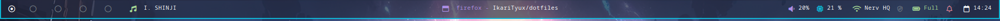
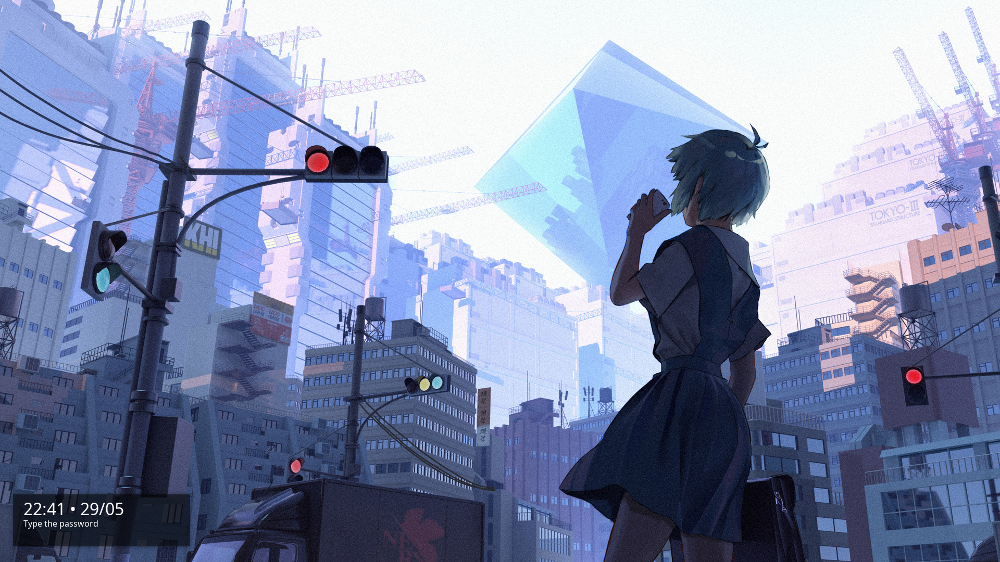

# Dotfiles

# Dependencies
## Programs needed
- i3
- polybar
- rofi
- feh
- lxappearance
- sddm
- [deadd notification center](https://github.com/phuhl/linux_notification_center)
- [betterlockscreen](https://github.com/betterlockscreen/betterlockscreen)

## Themes
- **GTK**: Tokyonight BL-LB 
- **QT**: Tokyonight 
- **Icons**: Tokyonight 
- **Terminal**: Tokyonight Storm  **/** 
- **SDDM**: Dawn 

## Colors
- Main `#24283b`
- Secondary `#0db9d7`
- Accent `#ad8ee6`
- Red `#ED8796`
- Green `#A6DA95`
- Yellow `#EED49F`
- foreground `#ffffff`
- Alert `#cc1616`
> Colors inspiration: Catppuccin & Tokyonight

# Polybar

# Betterlockscreen

