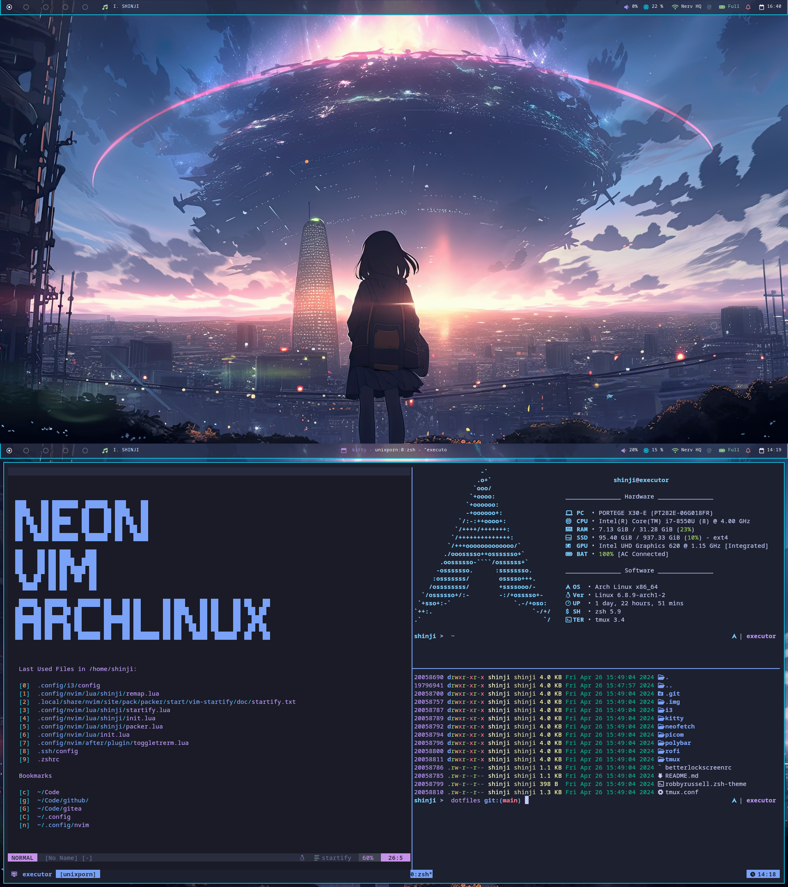

# Dotfiles

## Programs needed
- i3
- polybar
- rofi
- kitty
- nitrogen
- fastfetch
- [betterlockscreen](https://github.com/betterlockscreen/betterlockscreen)

## Themes
- **GTK**: Tokyonight BL-LB 
- **QT**: Tokyonight 
- **Icons**: Tokyonight 
- **Terminal**: Tokyonight Storm  **/** 

