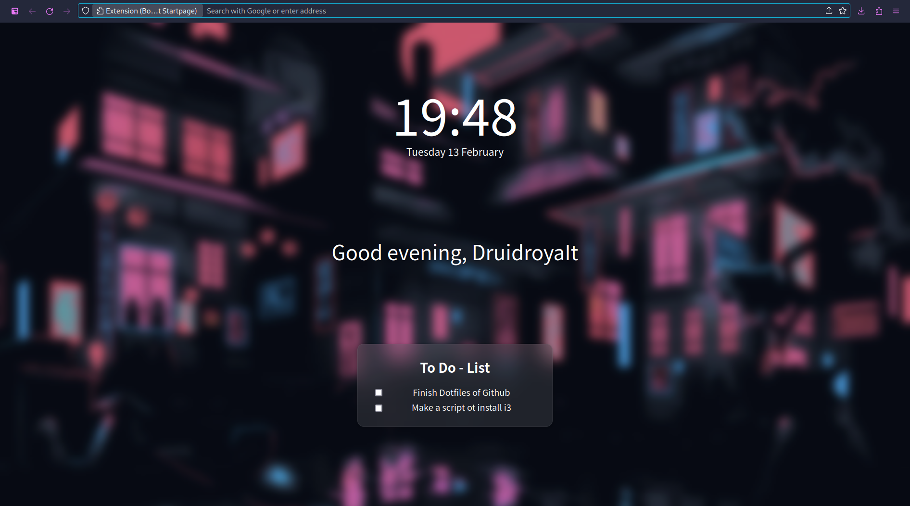

# Firefox config

In order to transform Firefox like that,

1. Copy the `userContent.css` & `uSerChrome.css` into your firefox profile (~/.mozilla/$profile/chrome)
2. Install theses 3 extentions: 
  - [Tree Style Tab](https://addons.mozilla.org/fr/firefox/addon/tree-style-tab/)
  - [Firefox Color](https://addons.mozilla.org/fr/firefox/addon/firefox-color/)
  - [Bonjourr](https://addons.mozilla.org/fr/firefox/addon/bonjourr-startpage/)
3. To install the theme, follow this link: [Theme](https://color.firefox.com/?theme=XQAAAALlAgAAAAAAAABBKYhm849SCicxcUKvrXcGHf3p79EhVPYCjxriUDk0O-GWysCv-Zw_c313b2veTh1iiDJizyLERXc8rLN6WsKGEIQYsAh2iJ5JolWzv9r9wJbQx8_KG8fDitxg-GMm95RCfjy5xziIdFOFXfMVuw0h4aPAFGNwnoPt4-UI3SWGGTPmyJZTFBNTSm7l9bxZH_hwS2om3hh-uql5tNa1sUrZTGqJqV07XWhqBGJrtz0EAGoWPT1PslF_K3UGFeG-To_IsIh2IG9Kz1VoT0eAPb6nbV93izbowG9sylfoYHeJxQsfYbMbWCzwZbB6Yg9VT_ITMzrBJDE4dPtYdMoHWhG8DYSeVLR_gxGEKidWNSZZEg5pFByhfkW3-8O6tVy_XU9u1avUAi7pU6hMo0HTatprF7EO-GvI0wkFMYGgjr__mvOoOg)
4. At last, if you want the same homapage as me, import the `homepage.json` file

BTW, i use [Floorp](https://github.com/Floorp-Projects/Floorp)(A Firefox ESR fork) so i can set a shortcut to toggle the tabs.
